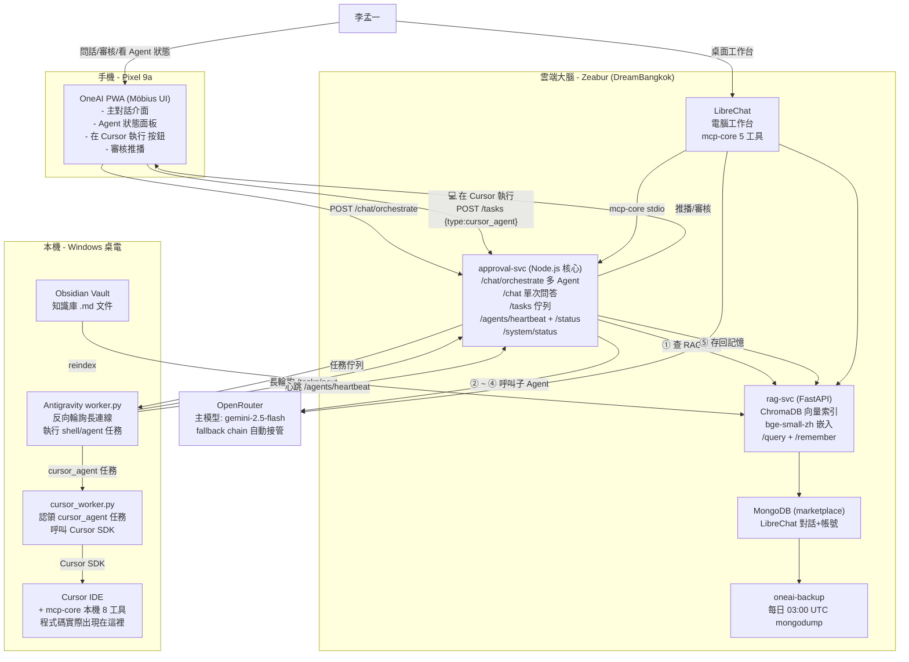
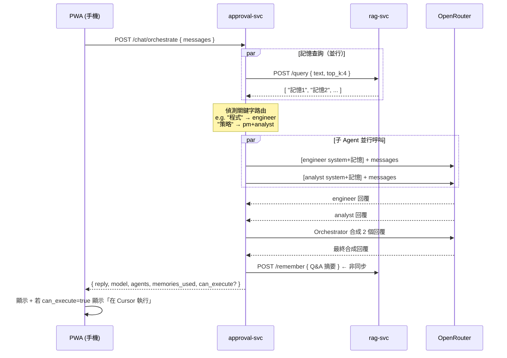
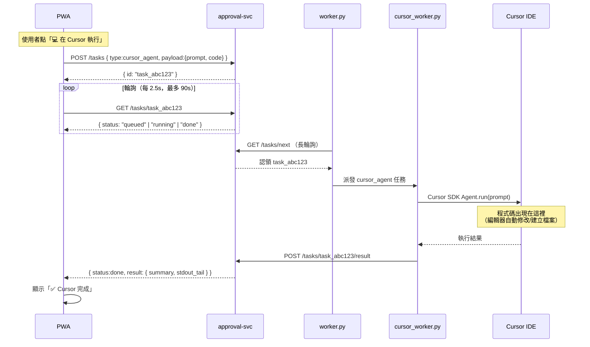

# 01 - OneAI 系統架構（v3，2026-06-21）

> 本文反映**當前實際部署狀態**（v3 = Multi-Agent + Soul/RAG 記憶 + Cursor 執行）。
> 部署細節見 [`infra/zeabur/.deploy-state.md`](../infra/zeabur/.deploy-state.md)。
> 多組織 Agent 授權設計見 [`ADR-001`](ADR-001-multi-agent-architecture.md)。

---

## 1.0 設計哲學

> **「越用越了解你的全方位個人助理」**
>
> 不只是問答機器——是一個有記憶、有手腳、有多位專家同時待命的個人 AI 生態系。

三個核心能力：
1. **永不遺忘** — 每次對話自動存入 RAG，記憶隨時間累積
2. **多 Agent 協作** — Orchestrator 自動路由到最適合的專家 Agent
3. **有手有腳** — 雲端大腦可以呼叫本機桌電執行實際任務

---

## 1.1 整體架構圖



---

## 1.2 Multi-Agent Orchestrate 資料流（核心流程）



---

## 1.3 Engineer → Cursor 執行資料流



---

## 1.4 Soul 記憶層（讓 OneAI「越用越了解你」）

```
L1 核心人格（靜態）
   └─ MENGYI_BRIEF：21 歲、清邁、使命、三爽、5-Why…
      永遠注入所有 Agent system prompt

L2 工作記憶（對話 session）
   └─ historyRef：最近 12 輪對話上下文
      存在 PWA 前端 sessionStorage

L3 長期記憶（跨 session 累積）
   └─ rag-svc ChromaDB：每次對話後自動存入
      下次問相關問題時自動召回注入
      來源 1：Obsidian vault .md 文件
      來源 2：每次 Q&A 自動記憶
```

> 目前每次對話存入格式：
> `[對話記憶 2026-06-21] 問：... 答：...`（前 600 字）

---

## 1.5 元件職責總表（v3）

| 元件 | 位置 | 職責 |
|---|---|---|
| **OneAI PWA** | 手機 / 瀏覽器 | 主對話介面、Möbius Orb、Agent 面板、「在 Cursor 執行」按鈕、記憶使用提示 |
| **approval-svc** | Zeabur | **核心**：Orchestrate + 記憶注入 + 任務佇列 + Agent 心跳 + 審核 |
| **rag-svc** | Zeabur | Soul L3：向量查詢 + 記憶寫入（ChromaDB + bge-small-zh） |
| **LibreChat** | Zeabur | 電腦工作台；mcp-core 讓 AI 存取 OneAI 工具 |
| **MongoDB** | Zeabur | LibreChat 對話歷史 + 帳號 |
| **oneai-backup** | Zeabur | 每日 03:00 UTC mongodump，保留 7 天 |
| **Antigravity worker.py** | 本機 | 反向輪詢任務佇列，執行 shell/cursor_agent，30s 心跳 |
| **cursor_worker.py** | 本機 | 認領 `cursor_agent` 任務，呼叫 Cursor SDK → IDE 執行 |
| **Cursor IDE** | 本機 | 程式碼的實際執行環境；mcp-core 8 工具可供 Cursor AI 使用 |
| **Obsidian vault** | 本機 | 知識庫 `.md`，reindex 到 rag-svc 成為長期記憶 |
| **OpenRouter** | 雲端 | 所有 LLM 統一閘道，主模型 `gemini-2.5-flash` + fallback chain |

---

## 1.6 Multi-Agent 路由規則

| 觸發關鍵字 | 路由 Agent | 模型 |
|---|---|---|
| 程式、code、bug、部署、架構、docker、git… | 💻 工程師 | claude-sonnet-4-6 |
| 策略、產品、OKR、市場、競爭、簡報… | 📊 PM | gemini-2.5-flash |
| 平衡、時間、壓力、目標、迷失… | 🧘 教練 | gemini-2.5-flash |
| 分析、數據、報告、風險、評估… | 🔍 分析師 | gemini-2.5-flash |
| 多個類別同時觸發 | 並行呼叫多個 + Orchestrator 合成 | - |
| 無匹配 | 🧠 OneAI 通用 | gemini-2.5-flash |

---

## 1.7 技能擴展方式

| 想加什麼 | 怎麼做 | 難度 |
|---|---|---|
| 新 Agent 人格（如法律顧問） | `config/oneai.agents.json` + `AGENT_SYSTEMS` 加一條 | ⭐ |
| 新路由關鍵字 | `agents.json` orchestrator.routing_triggers | ⭐ |
| 新 MCP 工具（如網頁截圖） | `mcp-core/src/server.js` 加 tool | ⭐⭐ |
| 上網搜尋能力（Researcher Agent） | Tavily API + 新 agent | ⭐⭐ |
| 新本機 Python 技能 | `worker.py` executor 加 task type | ⭐⭐ |
| Cursor skill 接入 | `cursor_worker.py` dispatch + Cursor `.agents/skills/` | 自動相容 |

---

## 1.8 待辦 / 延後項目

| 項目 | 狀態 | 說明 |
|---|---|---|
| Backup Volume 掛載 | **待手動** | Zeabur Dashboard → oneai-backup → Storage → `/data/backups` |
| Worker 開機自動啟動 | **待手動** | 管理員 PS 執行 `install-worker-task.ps1` |
| cursor_worker.py 啟動 | 手動 | `python hands/cursor-agent/cursor_worker.py` |
| Researcher Agent（上網） | 延後 | 需 Tavily API key |
| dreamone.li Gateway | 延後 | 目前用 `.zeabur.app` 免費網域 |
| GitHub Offsite Backup | 選填 | 設 `GITHUB_BACKUP_TOKEN` 到 backup 服務 |
| Obsidian Mobile 同步 | 選填 | iCloud 或 Obsidian Git plugin |

---

## 1.9 核心設計決策

1. **API key 不出伺服器** — PWA 只帶 `VITE_APPROVAL_TOKEN`，OpenRouter key 存 `approval-svc`
2. **反向輪詢** — 本機不開 port，NAT 穿透零設定，最安全
3. **記憶自動累積** — 每次對話後 `/remember` 非同步存入，不影響回應速度
4. **Fallback chain** — 主模型失敗自動嘗試備用模型，確保不中斷
5. **SSOT 設定** — `config/oneai.agents.json` + `config/oneai.models.json` 是所有設定的唯一來源
6. **SW skipWaiting** — 新版 PWA 部署後手機立即接管，不需手動清快取
