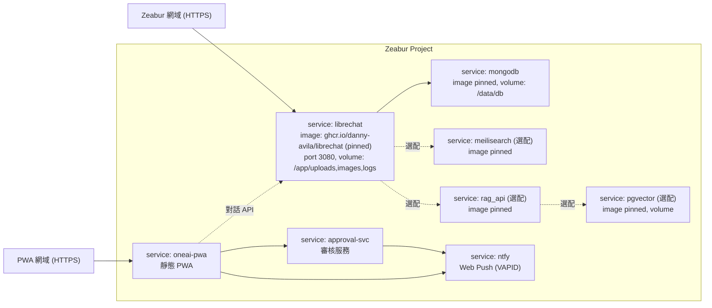

# 03 - 雲端大腦：LibreChat 部署於 Zeabur

> 決策依據：[docs/14](14-stack-licensing-research.md)。雲端大腦由 Odysseus 改為 **LibreChat（MIT）**——成熟、可白牌、自帶 Agents/MCP/RAG/記憶/多用戶認證。

## 3.1 前提與限制

- Zeabur **不支援 docker-compose**。LibreChat 原生為多容器（`LibreChat` / `MongoDB` / `MeiliSearch` /（選配）`rag_api` + `pgvector`），須拆成獨立 Zeabur 服務，以環境變數互連。
- 初期最小化為 **`librechat` + `mongodb`**；搜尋（MeiliSearch）與檔案 RAG（rag_api + pgvector）視需要再加。
- 通知與審核採**自架 ntfy**（Web Push）+ 小型**審核服務**，並部署 **OneAI PWA**（手機面）。見 [07](07-guardrail-ntfy-approval.md)、[11](11-oneai-pwa-interface.md)。
- LLM 走 **OpenRouter** 統一閘道（OpenAI 相容，一把 key 涵蓋 OpenAI / Gemini / Anthropic 等 300+ 模型，且支援自動 failover）。要用哪個模型由 `config/oneai.models.json` 決定，不寫死在程式（見 [10](10-roadmap-phases.md)）。
- 我們的差異化能力（vault 檢索 / 寫回 / 審核 / 本機手）透過 **`bridge/mcp-core`** 以 MCP 掛進 LibreChat（見 [05](05-bridge-mcp-federation.md)）。

## 3.2 服務拓樸



## 3.3 部署步驟

1. **建立 Zeabur 專案**：用已登入的 `zeabur` CLI 或 Dashboard 建立新專案。
2. **部署 `mongodb`**：prebuilt image（pinned 版本），掛 volume 至 `/data/db`，**不對外暴露原始埠**。
3. **部署 `librechat`**：使用官方 image `ghcr.io/danny-avila/librechat`（鎖定版本，勿用 `:latest`）。設 `PORT=3080`、掛 volume（`/app/uploads`、`/app/client/public/images`、`/app/api/logs`）。
4. **掛載設定檔**：將 `librechat.yaml`（含 MCP server、記憶設定）掛進容器，並以 env 指向之。
5. **（選配）MeiliSearch**：訊息搜尋；可省。
6. **（選配）`rag_api` + `pgvector`**：檔案 RAG；本系統知識庫主要走我們的 `vault_query`，故此項非必要。
7. **設定環境變數**（見下）。
8. **綁定網域**：用 Zeabur 提供的 HTTPS 網域。
9. **驗收**：登入 → 建立一個 Agent → 確認可呼叫 `mcp-core` 工具（`vault_query`）。

## 3.4 關鍵環境變數（雲端化）

對照 LibreChat `.env.example`，雲端部署務必調整：

```bash
# 對外與資安
HOST=0.0.0.0
PORT=3080
DOMAIN_CLIENT=https://<你的-zeabur-網域>
DOMAIN_SERVER=https://<你的-zeabur-網域>
TRUST_PROXY=1                       # 經 HTTPS 反向代理

# 認證機密(用強隨機值,勿進 git)
CREDS_KEY=<32-byte hex>
CREDS_IV=<16-byte hex>
JWT_SECRET=<隨機>
JWT_REFRESH_SECRET=<隨機>

# 註冊控制(個人用建議關閉公開註冊)
ALLOW_REGISTRATION=false
ALLOW_EMAIL_LOGIN=true

# 資料庫(指向同專案 mongodb 內網名)
MONGO_URI=mongodb://<mongodb-內網名>:27017/LibreChat

# LLM 閘道:OpenRouter(OpenAI 相容,單一入口涵蓋多家模型)
OPENAI_BASE_URL=https://openrouter.ai/api/v1
OPENAI_API_KEY=<openrouter-key,形如 sk-or-v1-...>

# 設定檔位置(掛載的 librechat.yaml)
CONFIG_PATH=/app/librechat.yaml

# (選配)搜尋 / RAG
MEILI_HOST=http://<meilisearch-內網名>:7700
MEILI_MASTER_KEY=<隨機>
RAG_API_URL=http://<rag_api-內網名>:8000
```

> Zeabur 服務間以服務名稱在內網互連；把 `MONGO_URI` / `MEILI_HOST` / `RAG_API_URL` 指向對應服務內網位址。

## 3.5 掛載我們的 MCP 能力（librechat.yaml）

`librechat.yaml` 內設定 MCP server 與記憶。重點片段：

```yaml
version: 1.2.1

# 記憶 agent:每請求都跑,設上限控成本(研究查到的坑)
memory:
  disabled: false
  personalize: true
  tokenLimit: 4000
  messageWindowSize: 6
  agent:
    provider: openAI
    model: gpt-4o-mini
  # 限制送進記憶 agent 的近期對話量,避免拖垮自架後端
  maxInputTokens: 12000

mcpServers:
  mcp-core:
    command: node
    args: ["/app/mcp-core/src/server.js"]
    env:
      APPROVAL_BASE_URL: "http://<approval-內網名>:8787"
      VAULT_MAX_CHARS: "8000"     # 防 host 把大回傳整包讀進記憶 OOM
```

> 注意：`run_local_command` / `run_local_task`（本機手）依賴本機環境，雲端 LibreChat 內不可用；雲端只用 `vault_query` / `remember` / `request_approval`。本機手請由本機端的 MCP host（Cursor / 本機 LibreChat）掛載。詳見 [05](05-bridge-mcp-federation.md)、[12](12-antigravity-hands.md)。

## 3.6 安全設定要點

- 切勿公開暴露 MongoDB / MeiliSearch / pgvector 的原始埠，只暴露 `librechat` 的 HTTPS 網域。
- 所有機密（`CREDS_KEY`、`JWT_*`、API 金鑰）只放 Zeabur 環境變數，不進 git。
- 個人用建議 `ALLOW_REGISTRATION=false`，避免他人註冊。
- `vault_query` 已限長（`VAULT_MAX_CHARS`），避免大回傳造成 OOM。

## 3.7 成本控管

- 初期只開 `librechat` + `mongodb`。
- 搜尋（MeiliSearch）與檔案 RAG（rag_api + pgvector）省略，知識庫走 `vault_query`。
- 視用量再擴充。

## 3.8 附加服務：ntfy / 審核服務 / OneAI PWA

- **ntfy**：官方 image（pinned）。`NTFY_BASE_URL`、Web Push（VAPID）金鑰；開 auth、審核 topic 加 token、禁匿名發布。**訊息/Web Push/auth 三個 db 檔(`/var/cache/ntfy`、`/var/lib/ntfy`)須掛持久卷**，否則重啟掉離線補收與帳號。
- **審核服務（approval-svc）**：提供 `/request`（**非阻塞**，回 `202 + approval_id`）、`/status/<id>`（輪詢）、`/approve|reject/<id>?t=<actionToken>`、逾時預設拒絕；內網呼叫 ntfy 發通知。**必設 `APPROVAL_TOKEN`**（組件間鑑權）並把 `APPROVAL_DATA_FILE`(`/app/data`) **掛持久卷**（重啟不遺失待審/決定）。詳見 [07](07-guardrail-ntfy-approval.md)。
- **OneAI PWA（oneai-pwa）**：Vite build 靜態檔 + service worker，獨立 HTTPS 網域；前端內嵌 VAPID 公鑰，私鑰僅後端。對話可走 LibreChat API。詳見 [11](11-oneai-pwa-interface.md)。

## 3.9 雲端 vs 本機放置與穩定度分層

**判準**：①手機/外部要連得到？②關機就不能停？③資料掉了出大事？任一為「是」→ 上雲；否則留本機。

| 元件 | 放置 | 穩定度層級 | 說明 |
|---|---|---|---|
| ntfy（推播） | ☁️ 雲端 | **Tier 0 護欄** | 手機要收得到，必須隨時在 |
| approval-svc（審核） | ☁️ 雲端 | **Tier 0 護欄** | agent+手機都連、安全閘門；已 fail-safe（不可達/逾時→拒絕） |
| LibreChat（控制平面） | ☁️ 雲端 | Tier 1 | 任何地方都要進得來 |
| MongoDB（LibreChat 狀態） | ☁️ 雲端（有狀態） | Tier 1 | 對話/設定，需持久卷+備份 |
| Hermes（24/7 worker，Phase C） | ☁️ 便宜 VPS | Tier 2 | 長時自走，與本機手分機隔離 |
| OneAI PWA | ☁️ 靜態/CDN | 靜態 | 純前端，CDN 最穩 |
| GitHub remote（vault 備份） | ☁️ | 備援 | vault「永存」副本＝永不遺忘底線 |
| Obsidian vault 主檔 | 💻 本機 | SSOT | 本地優先，git 推雲備援 |
| Antigravity（本機手） | 💻 本機 | — | 操作本機，只能本機 |
| ChromaDB / RAG | 💻 本機（內嵌） | — | 跟著查詢端跑 |
| mcp-core（本機手用） | 💻 本機 | — | 緊鄰 Antigravity |

> **Tier 0（ntfy + approval-svc）最該鐵打**：一掛＝所有關鍵動作停擺。好處是兩者刻意保持「少依賴、小體積」，且護欄已 fail-safe＝就算掛了也是「安全地停住」而非亂跑。這也是不採 OpenClaw 當入口的延伸好處（少一個高風險常駐）。

## 3.10 穩定化手段（讓雲端最穩）

1. **有狀態的東西掛持久卷 + 備份**：`approval-svc`(`/app/data`)、`MongoDB`(`/data/db`)、`ntfy`(`/var/cache/ntfy`、`/var/lib/ntfy`)。再加每日備份（Mongo dump；vault 靠 git）。
2. **健康檢查 + 自動重啟**：各服務設 `/health` 探針（approval-svc 已有，Dockerfile 內含 `HEALTHCHECK`）+ restart policy。
3. **版本釘死（pin）**：ntfy / LibreChat / MongoDB 用固定版本 tag，**禁用 `:latest`**，避免自動更新弄壞。
4. **護欄保持精簡**：Tier 0 兩服務維持最少依賴（approval-svc 僅 express+web-push）；依賴越少越不易壞。
5. **分機隔離**：Tier 0 護欄與 Tier 1 大腦**分開部署**，LibreChat 出事不拖垮審核；Hermes 放別台 VPS。

## 3.11 驗收清單

- [ ] HTTPS 網域可登入，admin 帳號生效。
- [ ] Chat 可正常對話（雲端 API 連通）。
- [ ] 建立 Agent 並成功呼叫 `mcp-core` 的 `vault_query`（回傳已限長）。
- [ ] `remember` 寫回後可被 `vault_query` 檢索到。
- [ ] 重啟服務後對話/設定仍在（MongoDB volume 正常）。
- [ ] **重啟 approval-svc 後待審/決定仍在（`/app/data` 持久卷正常）。**
- [ ] **approval-svc 未設 `APPROVAL_TOKEN` 時啟動有警告；設了之後無 token 呼叫 `/request` 回 401。**
- [ ] **各服務 `/health` 綠燈、版本為固定 tag（非 `:latest`）。**
- [ ] MongoDB / MeiliSearch / pgvector 未對外暴露。

## 3.12 實際部署結果（as-built，2026-06）

> 以下為真實上線狀態與「計畫 vs 實作」的差異。服務 ID / 變數 / 重新部署指令見 `infra/zeabur/.deploy-state.md`。

### 線上服務

| 服務 | 來源 | 對外網址 | 內網位址 |
|---|---|---|---|
| librechat | repo 根 context + `infra/zeabur/librechat/Dockerfile`（薄包裝官方映像 + 打包 mcp-core） | `https://oneai-chat.zeabur.app` | — |
| mongodb（marketplace） | Zeabur 模板 `KXL04P` | — | `mongodb-noing.zeabur.internal:27017` |
| rag-svc | `brain/Dockerfile` | — | `rag-svc.zeabur.internal:8080` |
| approval-svc | `services/approval/Dockerfile` | `https://oneai-approval.zeabur.app` | — |
| oneai-pwa | `apps/oneai-pwa/Dockerfile`（nginx） | `https://oneai-mengyi.zeabur.app` | — |

- 登入帳號：`mengyi@oneai.local` / `OneAI-Brain-2026`（無 SMTP，故於 mongo 手動設 `emailVerified:true`）。
- LLM 預設 OpenRouter，$300/月預算；模型清單見 `config/oneai.models.json`。

### 與計畫的關鍵差異（重要）

1. **MongoDB 改用 marketplace 模板，不要自訂 Dockerfile**：Zeabur 對「只有 Dockerfile」的服務會把 `EXPOSE` 當成 **HTTP web 埠**，純 TCP（mongo 27017）會逾時不通。marketplace `KXL04P` 會正確宣告 **TCP 27017** 並自帶帳密/連線字串。`MONGO_URI` 形如 `mongodb://mongo:<pw>@mongodb-noing.zeabur.internal:27017/LibreChat?authSource=admin`。
2. **mcp-core 以 stdio 打包進 librechat 映像**：故 librechat 從 **repo 根目錄** build（要帶 `bridge/`、`scripts/`、`config/`），根目錄 `.zeaburignore`/`.dockerignore` 排除 `brain/`(1.2GB)、`node_modules` 等。檔案落在 `/app/oneai`，結構保留以便 `bridge/mcp-core/src` 解析 `../../../scripts`。
3. **雲端只掛 5 個安全工具**：以 `ONEAI_CLOUD=1` 讓 `server.js` 不註冊 `run_local_*`（本機肉體）。librechat 服務變數：`RAG_API_URL=http://rag-svc.zeabur.internal:8080`、`APPROVAL_BASE_URL=https://oneai-approval.zeabur.app`、`APPROVAL_TOKEN=<見 .env>`。
4. **PWA 的 nginx 必須監聽 `$PORT`**：Zeabur 注入 `PORT` 並據此路由，硬編 `listen 80` 會 502。改用官方 nginx 映像的 envsubst（把 `nginx.conf` 放 `/etc/nginx/templates/*.template`，內含 `listen ${PORT};`）。`VITE_*` 由 Zeabur 服務變數當 build args 烤入。
5. **強制使用 Dockerfile**：對含原始碼的服務，zbpack 可能自動偵測（誤判靜態站或自選 builder）。一律設服務變數 `ZBPACK_DOCKERFILE_PATH=<相對 context 的 Dockerfile 路徑>`。

### Zeabur CLI 實戰雷區

- **務必直呼 `zeabur.exe`**：npm 安裝的 `zeabur` 是 PowerShell wrapper，會吞掉 `--` 之後的參數，並讓 `template deploy` **靜默無效**。改用 `…\node_modules\zeabur\zeabur_windows_amd64_v1\zeabur.exe` 後 `template deploy`、`service exec -- …` 全部正常。
- **多層引號（PowerShell→zeabur→sh→mongosh）**：把腳本 base64 後在容器內 `echo <b64> | base64 -d > /tmp/x.sh && sh /tmp/x.sh`，徹底繞過引號/`$` 地獄。
- **網域撞名**：`oneai-pwa` / `oneai-jarvis` 等熱門名常被佔；`domain create --domain <name>` 失敗就換名（最終用 `oneai-mengyi`）。

### 仍待完成

- 手機（Pixel 9a）開 PWA → 允許通知（Web Push 訂閱）→ 從對話觸發 `request_approval` → 手機點允許/拒絕，驗證完整審核迴圈（VAPID 公鑰兩端已確認一致）。
- 登入 LibreChat UI 確認 agent 工具面板出現 `oneai-core`。
- 本機 Antigravity 橋樑（加密 MCP）以開通 `run_local_*`。
- 自訂網域 `dreamone.li`（各服務 `domain create --domain` 綁定）。
