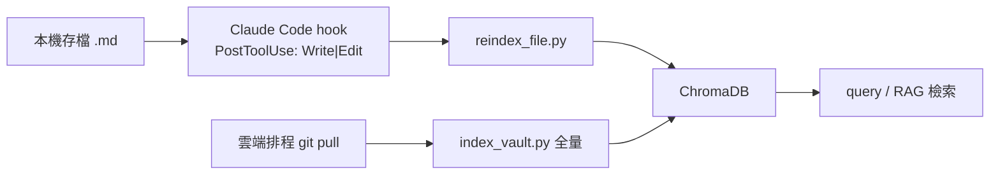

# 04 - The Brain：Obsidian 數位孿生知識庫 + RAG

## 4.1 目標

讓 agent 讀得到「李孟一」過去的提案、SOP、觀點，形成可被檢索的數位孿生，使輸出語氣一致、去 AI 味。Obsidian vault 是知識來源（markdown），ChromaDB 是向量後台（索引）。

## 4.2 vault 存放策略（業界通用做法）

- **本機為主**：vault 為一般資料夾的 `.md` 檔，留在本機。
- **git 同步**：用 `obsidian-git` plugin 每 30 分鐘 auto-commit、定時 push 到**私有** GitHub repo（免費版本控管 + 備份）。
- **雲端取用**：Zeabur 端排程 `git pull` 同一 repo，再 ingest 進 ChromaDB 供 RAG。
- 跨裝置即時同步可另加 Syncthing；但 git 已足夠當單一事實來源。

`.gitignore` 範例：

```gitignore
.obsidian/workspace.json
.obsidian/plugins/*/data.json
.DS_Store
.smart-env/
# 大型附件改用外部儲存，勿進 git 歷史
```

> 注意：避免把 >1MB 附件提交進 git，否則 clone 永久變慢。必要時加 pre-commit 檔案大小檢查。

## 4.3 vault 資料夾結構（防 AI 污染）

```
vault/
├── CLAUDE.md                # 知識庫 schema 與行為約束（agent system prompt）
├── persona/
│   └── 李孟一-persona.md     # 語氣 / 邏輯 / 去 AI 味守則
├── raw/                     # 來源文件、逐字稿、擷取資料 —— LLM 永不寫
├── wiki/
│   ├── concepts/            # 原子概念筆記（一檔一概念）
│   └── topics/              # 綜整主題筆記（連結多個概念）
├── insights/                # 你的人類觀點 —— agent 唯讀
└── output/                  # 產出的摘要 / 報告
```

規則（寫入 `CLAUDE.md`）：

- LLM **永不修改** `raw/` 與 `insights/`。
- `wiki/` 筆記用 YAML frontmatter + `[[wikilink]] `互連，概念保持原子化。
- 變更後更新 `_index.md` 主索引。
- 命名 / metadata / 標籤規範統一定義於 `CLAUDE.md`。

## 4.4 persona「去 AI 味」檔

`persona/李孟一-persona.md` 萃取自你過去的提案、SOP、Threads 觀點，內容建議涵蓋：

- 語氣與用詞偏好（句長、口頭禪、避免的 AI 腔）。
- 邏輯與論述結構（先講結論 / 先講脈絡）。
- 價值觀與判斷準則。
- 正反例（好的句子 vs 要避免的 AI 味句子）。

此檔在簡報、提案、貼文等所有對外產出時優先載入。

## 4.5 讀寫管道：Obsidian MCP（採現成、不自寫）

**已選定 `lstpsche/obsidian-mcp`（MIT、Rust 單一執行檔、檔案直存）**——理由：與我們「vault 就是一個 git 資料夾」模型最契合,**Obsidian 沒開也能跑**(免 Local REST API plugin)、適合無頭自動化;原生懂 wikilink/frontmatter/tag/block,內建 BM25(Tantivy)+語意搜尋+反向連結。決策見 [docs/14 §14.x OSS 盡職調查](14-stack-licensing-research.md)。

1. 下載 `obsidian-mcp` 單一二進位,設定 vault 路徑(指向 `brain/vault/`)。
2. 在 Cursor / Claude Code / LibreChat（經橋樑）註冊此 MCP（stdio 或 HTTP）。
3. （備案）若改用需 plugin 的 `cyanheads/obsidian-mcp-server`（Apache-2.0、590★、最成熟），需 Obsidian 開著 + `Local REST API` plugin + API key。

可用工具：`note_read` / `note_create` / `note_write` / `note_append` / `note_patch`(改 heading/block/frontmatter) / 搜尋 / 反向連結 等,支援精準修改不動其餘內容。

> 安全：MCP 對 vault 有完整 CRUD 權限，務必先備份；用 `raw/` `insights/` 唯讀規則約束;寫入/刪除走我們的審核護欄(經 `mcp-core` 的 `request_approval`)。

## 4.6 RAG 索引管線



- **切塊**：依 heading（`#`/`##`/`###`）切 section-level chunk，metadata 存檔案路徑、heading、行號。
- **即時**：本機存檔觸發單檔 reindex。
- **全量**：雲端定期 pull 後跑全量 index（補同步落差）。
- **規模建議**：vault < 100 篇，LLM context 直接讀即可；> 100 篇再啟用 RAG 檢索。

Claude Code hook 範例（概念）：

```json
{
  "hooks": {
    "PostToolUse": [
      {
        "matcher": "Write|Edit",
        "command": "python /path/reindex_file.py /path/vault $FILE_PATH"
      }
    ]
  }
}
```

## 4.7 與雲端 ChromaDB 的關係

- 本機 reindex 與雲端全量 index 寫入**同一個** ChromaDB（雲端服務），確保 PM / Code Review / 簡報 agent 都能檢索最新知識。
- 若擔心私密內容上雲，可採「雙庫」：敏感 `insights/` 只在本機索引，雲端僅索引 `wiki/` 與 `raw/` 的可分享部分。

## 4.8 驗收清單

- [ ] vault 結構建立，`CLAUDE.md` schema 就緒。
- [ ] persona 檔可被產出流程載入，語氣明顯去 AI 味。
- [ ] obsidian-mcp 可讀寫，且無法寫入 `raw/` `insights/`。
- [ ] 存檔即時 reindex 生效。
- [ ] 雲端可檢索 vault 內容並正確引用。
