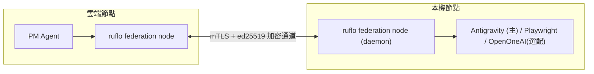

# 05 - 橋樑：MCP 與 ruflo Federation

> ⚠️ **狀態（2026-06-23）**：**ruflo federation 已棄用**。雲↔本機改 **反向輪詢 worker**（[12 §12.9](12-antigravity-hands.md)）。  
> `bridge/mcp-core` 仍用於 LibreChat/Cursor MCP；federation 章節為歷史參考。

> 更新：雲端大腦改 **LibreChat（MIT）**，我們的能力透過 `bridge/mcp-core` 以 MCP 掛進 LibreChat（見 [docs/14](14-stack-licensing-research.md)）。federation/mTLS→Tailscale 仍待拍板（[docs/13](13-design-review-simplification.md)）。

## 5.1 目標

建立雲端與本機之間的**加密任務通道**，讓雲端 PM Agent 能把任務派發到本機執行（Playwright / Shell），並收回結果。同時讓本機 Cursor 能呼叫雲端工作台與工具。

## 5.2 連線方案：ruflo federation

採用 ruflo 內建 federation（零信任，mTLS + ed25519），不額外裝 VPN。



特性：

- 遠端節點預設不受信任，靠 mTLS + ed25519 挑戰回應驗證身分。
- 對外訊息經 PII 過濾管線（可設 BLOCK / REDACT / HASH / PASS）。
- 每筆 federation 事件留審計紀錄。

設定流程（概念）：

```bash
# 兩端各自初始化
npx ruflo@latest federation init

# 本機加入雲端 federation 端點
npx ruflo@latest federation join wss://<雲端-federation-端點>

# 派發任務（PII 自動處理）
npx ruflo@latest federation send --to local --type task-request \
  --message "執行 Playwright 測試 suite X"

# 查狀態
npx ruflo@latest federation status
```

> 本機執行 agent 為 **Antigravity（主）**，由 ruflo node 經 SDK / `agy` CLI 呼叫；詳見 [12-antigravity-hands.md](12-antigravity-hands.md)。

## 5.3 本機 daemon 常駐

- 本機需常駐 ruflo federation node 作為 daemon，雲端任務才能即時送達。
- 本機離線時：雲端任務排隊，待本機上線後處理。
- Windows：建議以排程工作（Task Scheduler）或開機自動啟動方式維持 daemon。

## 5.4 MCP 註冊

### 5.4.1 ruflo MCP（本機多 agent 調度）

```bash
claude mcp add ruflo -- npx ruflo@latest mcp start
```

提供 `swarm_init` / `agent_spawn` / `memory_store` 等工具給本機 agent。

### 5.4.2 Obsidian MCP（知識讀寫）

見 [04-brain-obsidian-rag.md](04-brain-obsidian-rag.md) 5.5 節。

### 5.4.3 mcp-core 工具伺服器（核心）

`bridge/mcp-core` 把我們的差異化能力包成 MCP 工具，掛進 LibreChat（或本機 Cursor / Claude）。LibreChat 本身負責 LLM 對話，故本橋樑只提供 host 沒有的能力。

- 位置：`bridge/mcp-core/`
- 工具：`vault_query`（檢索知識庫，回傳已限長防 OOM）/ `remember`（寫回記憶）/ `request_approval`（手機審核）/ `run_local_command` / `run_local_task`（本機手，僅本機 host 可用）。
- 認證 / 設定：`APPROVAL_BASE_URL`、`VAULT_MAX_CHARS` 等以環境變數帶入（勿進 git）。詳見 `bridge/README.md`、[docs/03](03-cloud-librechat-zeabur.md) 3.5 節。

## 5.5 任務契約（雲 ↔ 本機）

統一的任務訊息格式，便於 PM 派發與結果回收：

```json
{
  "task_id": "uuid",
  "type": "playwright_test | shell | code_review | research",
  "payload": { "...": "..." },
  "require_approval": false,
  "callback": "cloud_pm_agent",
  "max_runtime_sec": 600
}
```

回傳：

```json
{
  "task_id": "uuid",
  "status": "success | failed | timeout",
  "summary": "精簡結果摘要",
  "log_excerpt": "最關鍵的數行 log",
  "artifacts": ["path/or/url"]
}
```

> 設計原則：本機回傳**精簡** log（最關鍵數行 + 摘要），避免把巨量 log 灌回雲端。

## 5.6 安全要點

- federation 通道全程加密；PII 過濾預設開啟。
- 本機 daemon 僅接受已驗證之雲端節點。
- 任務若 `require_approval=true`，雲端在派發/收尾時觸發 ntfy Web Push 審核（見 [07](07-guardrail-ntfy-approval.md)）。

## 5.7 驗收清單

- [ ] 兩端 federation 建立、互相驗證成功。
- [ ] 雲端發任務、本機接收並回傳結果。
- [ ] 本機 daemon 可常駐、離線後重連可續跑。
- [ ] ruflo / Obsidian MCP 在 Cursor 可用。
