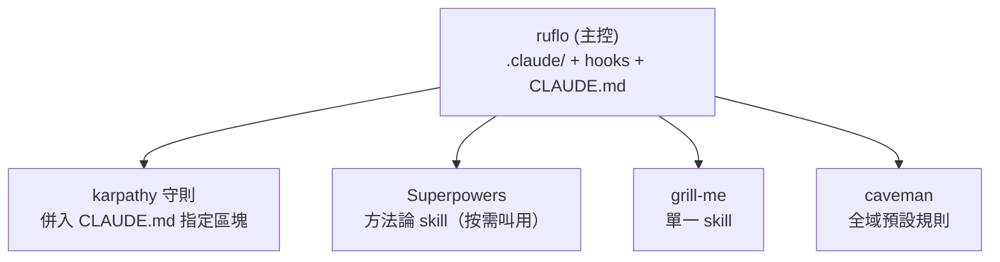

# 06 - Skills 整合與衝突隔離 + caveman 預設

## 6.1 衝突問題

`ruflo`、`Superpowers`、`karpathy-skills` 三者都會寫入 `CLAUDE.md` / `.claude/`，若同時安裝會互相覆蓋。必須擇一為主控層，其餘降級隔離。

## 6.2 廣用度分析與決策

| 專案 | 本質 | 能力 | 衝突風險 | 角色 |
|---|---|---|---|---|
| karpathy-skills | 單一 CLAUDE.md（編碼守則）| 被動規則，無編排 | 低（一份檔）| 基礎守則，併入 |
| Superpowers | 方法論 + skills 框架 | 規劃方法論 | 中 | 選用方法論 skill |
| ruflo | 多 agent meta-harness | 調度 / federation / hooks / Playwright | 高（接管全域）| **主控層** |

**決策**：以 **ruflo 為主控作業系統層**（管 `.claude/`、hooks、`CLAUDE.md`、agents、federation）。理由：唯一具備多 agent 調度與加密 federation，直接支撐「Agent 的 Agent」與雲↔本機派發。

## 6.3 整合策略（命名空間隔離）



- **karpathy**：把守則內容**併入** ruflo 的 `CLAUDE.md` 一個明確區塊（如 `## 編碼守則 (Karpathy)`），不另開覆蓋檔。
- **Superpowers**：以 skill 形式安裝，僅重度規劃任務手動叫用，不接管全域 `CLAUDE.md`。
- **grill-me**：單一 skill，放 skills 目錄即可，低衝突。
- **驗證共存**：先在獨立測試 repo 安裝全部，確認互不報錯，再推主環境。
- **掃描**：用 `ruflo metaharness` 評分設定就緒度、掃描工具設定的安全風險與衝突。

## 6.4 caveman 設為全域預設

需求：為省 token，所有 session 預設啟用 caveman；深度 / 複雜作業才取消。

- 本機已安裝：`c:\Users\b1993\.agents\skills\caveman`。
- 落地：在 ruflo 的全域 `CLAUDE.md` 加入預設規則，指示 agent 預設以 caveman 模式回應。

建議寫入 `CLAUDE.md` 的段落（範例）：

```markdown
## 預設溝通模式
- 所有回應預設使用 caveman 壓縮模式（保留使用者主要語言，繁體中文時可用 wenyan 模式）。
- 技術術語、程式碼、API 名稱、錯誤字串一律保持原樣，不縮寫。
- 自動退出 caveman 的情況：安全警告、不可逆動作確認、需要精確順序的多步驟說明。
- 使用者說「stop caveman / 正常模式」即關閉。
```

caveman 內建的 **Auto-Clarity** 已會在安全 / 不可逆 / 多步驟情境自動退出，正好對應「深度作業才取消」。

## 6.5 各 session 預設套用機制

- 因 ruflo 為主控，`CLAUDE.md` 會被每個 Cursor / Claude Code session 自動載入，達成「所有 session 預設 caveman」。
- 雲端 LibreChat 端：在系統提示 / agent preset 加入同等規則，使雲端 agent 一致。

## 6.6 驗收清單

- [ ] ruflo init 完成，為唯一主控層。
- [ ] karpathy 守則已併入 CLAUDE.md，無重複覆蓋檔。
- [ ] Superpowers / grill-me 可按需叫用，不接管全域。
- [ ] 四套 skills 同時存在不報錯（metaharness 通過）。
- [ ] 新開 session 預設 caveman；深度作業自動 / 手動可退出。
