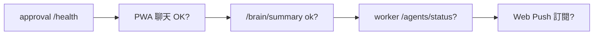

# 09 - 操作手冊與維運 Runbook

> **2026-06-23 更新**：PWA-first；LibreChat 已下線；Web Push 取代 ntfy。  
> 部署 SSOT → [`.deploy-state.md`](../infra/zeabur/.deploy-state.md) · 踩坑 → [17](17-lessons-learned-and-war-stories.md)

---

## 9.1 日常啟動

| 元件 | 怎麼確認 |
|------|----------|
| **雲端 approval** | https://oneai-approval.zeabur.app/health → `{ ok: true }` |
| **PWA** | https://oneai-mengyi.zeabur.app 可開 |
| **rag-svc** | `/brain/summary` → `status: ok` |
| **本機 worker** | `/agents/status` 非空；或 AgyPanel 能跑命令 |
| **LibreChat**（若恢復） | oneai-chat.zeabur.app 可登入 |

本機 worker：

```bash
python hands/antigravity/worker.py
# 或 INSTALL-WORKER.bat（開機自啟）
python hands/cursor-agent/cursor_worker.py   # Cursor 任務（選配）
```

---

## 9.2 常用操作

| 想做的事 | 怎麼做 |
|----------|--------|
| 手機對話 | PWA → 對梅蘭說 |
| 查 / 寫記憶 | PWA Memory Tab；或對話中 🧠 氣泡 |
| 控桌機 shell | PWA 設定 → 「直接控制桌機 Worker」 |
| 派送 Cursor 任務 | 對話含程式 → 「在 Cursor 執行」 |
| 審核高風險動作 | PWA 審核卡片 / Web Push |
| 跑雲端測試 | `python scripts/brain-smoke.py` |
| 跑 E2E | `python scripts/e2e-test.py`（可加 `--rate-limit` / `--legacy-chat`） |

---

## 9.3 健康檢查



**自動化腳本**：

```bash
node scripts/brain-intel.test.js    # 單元
python scripts/brain-smoke.py       # 雲端 orchestrate
python scripts/e2e-test.py          # 全 API
```

---

## 9.4 例行維護

- **每週**：`zeabur.exe service list` 清 orphan 服務；看 Zeabur 用量
- **每次 deploy 後**：跑 brain-smoke + 更新 `.deploy-state.md`
- **每月**：輪換高風險 token；確認 backup Volume 有資料

---

## 9.5 故障排除

| 症狀 | 可能原因 | 處置 |
|------|----------|------|
| PWA 永遠離線 | heartbeat / CORS | 確認 `/health` 有 CORS；見 doc 17 |
| 聊天 502 | approval crash | Zeabur logs；查 dockerignore / zbpack |
| 記憶全注入 / 每句已學習 | 舊版 brain | push 含 brain-intel 第二版 |
| AgyPanel 無回應 | worker 未跑 | `worker.py` + token 一致 |
| 搜尋無結果 | 缺 TAVILY_API_KEY | 設到 approval-svc env |
| SSE 404 | harness 未部署 | push 第二輪 + redeploy |
| rag 計數 0 | RAG 未連 | `RAG_SVC_HOST=rag-svc` |
| Cursor 任務無人認領 | 只跑了 agy worker | 另開 `cursor_worker.py` |

---

## 9.6 升級流程

1. 本機 `npm run build -w apps/oneai-pwa` + `node --check services/approval/src/server.js`
2. push `master` → 等 GitHub trigger build
3. **rag-svc 有改動時手動 deploy**
4. 跑 smoke / e2e
5. 更新 [17-lessons-learned](17-lessons-learned-and-war-stories.md) 若踩新坑

---

## 9.7 日誌位置

| 元件 | 位置 |
|------|------|
| approval-svc | Zeabur Dashboard → oneai-approval → Logs |
| rag-svc | 同上 |
| 本機 worker | 終端 stdout |
| PWA | 瀏覽器 DevTools |

---

## 9.8 文件維護

新增功能後更新：對應專篇 + [17](17-lessons-learned-and-war-stories.md) + `.deploy-state.md`。
