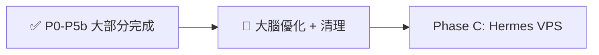

# 10 - 分階段執行計畫（含完成度）

> **2026-06-23 重寫**：反映 as-built 與待辦。詳細待辦 → [17 §13](17-lessons-learned-and-war-stories.md#13-待完成事項從戰史提煉)

---

## 已完成 ✅

| Phase | 內容 | 驗證 |
|-------|------|------|
| P0 安全 | `.env.example`、token 分離 | doc 08 |
| P1 雲端 | approval + rag + pwa 上線 | health / e2e |
| P2 Brain | rag-svc、vault 索引腳本 | /brain/summary |
| P3 橋樑 | **反向輪詢 worker**（取代 federation） | /tasks 佇列 |
| P5 護欄 | approval-svc + Web Push | 審核 API |
| P5b PWA | Orb、四 Tab、orchestrate 聊天 | oneai-mengyi |
| 加值 | Multi-Agent、Tavily 搜尋、AgyPanel、brain-intel v1 | brain-smoke |

## 進行中 🔄

| 項目 | 說明 |
|------|------|
| brain-intel v2 | harness、SSE、去重、kind — **本地待 push** |
| Zeabur 清理 | 刪 video-wizard、統一 Dockerfile |
| worker 常駐 | INSTALL-WORKER.bat |
| backup Volume | Dashboard 手動掛載 |

## 待決策 ⚠️

| 項目 | 選項 |
|------|------|
| LibreChat | A. 退役，全面 PWA / B. 重新部署 |

## 延後 / Phase C ⏸

| 項目 | 說明 |
|------|------|
| Hermes 24/7 worker | 便宜 VPS，非 Zeabur |
| ntfy | Web Push 已夠 |
| dreamone.li Gateway | DNS 待設 |
| LangGraph / CrewAI | YAGNI |
| ruflo federation | 已棄用 |
| OpenOneAI | 已移出範圍 |

---

## 原 Phase 清單（歷史參考）

展開舊版 Phase 0-7 checklist

### Phase 0 - 安全
- [x] `.env.example`、機密隔離
- [ ] 6 repo 真偽驗證（見 doc 08）

### Phase 1 - 雲端大腦
- [x] approval + rag + pwa
- [~] LibreChat（曾部署，現下線）

### Phase 2 - Brain
- [x] rag-svc、index 腳本
- [ ] vault 結構完整化

### Phase 3 - 橋樑
- [x] 反向輪詢 worker（**取代 federation**）
- [ ] ruflo federation — **取消**

### Phase 5 / 5b
- [x] Web Push 護欄
- [x] PWA 會呼吸介面
- [~] ntfy — **延後**

### Phase 6 - E2E
- [x] `scripts/e2e-test.py` 雲端 PASS
- [ ] 手機 Web Push 實機全迴路
- [ ] worker 實機 Cursor 執行

---

## 里程碑對照

| 現在能示範 | 情境 |
|------------|------|
| PWA 多 Agent 對話 | S01 類 |
| 記憶注入 / 記住 | S17 類 |
| Tavily 搜尋 | deep research 類 |
| 任務佇列 + worker | S10 類（需 worker 在線） |

完整 20 情境 → [02-scenarios.md](02-scenarios.md)
