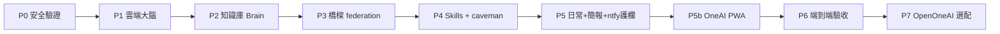

# 10 - 分階段執行計畫與 Checklist

依序推進，前一階段未通過驗收不進下一階段。安全（Phase 0）為硬門檻。

## Phase 0 - 安全驗證與前置（硬門檻）
- [ ] 驗 6 repo 真偽（[08](08-security.md)）。
- [ ] 審 LibreChat 官方映像版本（pin tag）/ librechat.yaml 設定。
- [ ] 鎖版本（pin commit / tag）。
- [ ] 建立 `.env.example` 與機密隔離規範。
- [ ] 確認 `zeabur` CLI 已登入。
- 產出：驗證報告、fork 後鎖定的 repo。

## Phase 1 - 雲端大腦（LibreChat on Zeabur）
- [ ] Zeabur 建 `librechat` + `mongodb`（MeiliSearch / rag_api 視需要）。
- [ ] 設雲端化 env（`APP_BIND` / `AUTH` / `SECURE_COOKIES` / 金鑰 / `CHROMADB_HOST`）。
- [ ] 掛 volume。
- [ ] 驗收：登入 + Chat + Deep Research。
- 參考：[03](03-cloud-librechat-zeabur.md)。

## Phase 2 - The Brain（Obsidian + RAG）
- [ ] 建 vault 結構（`raw/` `wiki/` `insights/` `persona/`）與 `CLAUDE.md` schema。
- [ ] 寫 `李孟一-persona.md`（餵提案 / SOP / Threads）。
- [ ] `obsidian-git` 同步私有 repo。
- [ ] obsidian-mcp 讀寫（`raw/` `insights/` 唯讀）。
- [ ] reindex hook + 雲端全量 index 進 ChromaDB。
- [ ] 驗收：雲端能引用 vault、語氣去 AI 味。
- 參考：[04](04-brain-obsidian-rag.md)。

## Phase 3 - 橋樑（ruflo federation + MCP）
- [ ] 兩端 federation init / join，驗證連線。
- [ ] 本機 daemon 常駐設定。
- [ ] Cursor / LibreChat 註冊 `mcp-core`；（選配）ruflo MCP。
- [ ] 接 Antigravity 為主要本機 Hands：SDK（`LocalAgentConfig` + policy）為主、`agy -p`+headless-bridge 為輔；`run_command` 走 ntfy 審核。
- [ ] 驗收：雲端派任務、本機 Antigravity 執行並回精簡結果。
- 參考：[05](05-bridge-mcp-federation.md)、[12](12-antigravity-hands.md)。

## Phase 4 - Skills 整合 + caveman
- [ ] ruflo init 為主控層。
- [ ] karpathy 併入 CLAUDE.md；Superpowers / grill-me 降級隔離。
- [ ] caveman 設全域預設。
- [ ] `ruflo metaharness` 掃衝突。
- [ ] 驗收：四 skills 共存不報錯、預設 caveman。
- 參考：[06](06-skills-caveman.md)。

## Phase 5 - 日常 + 簡報 + 護欄
- [ ] （選配）Email / 行事曆 / 筆記以 MCP 工具掛進 LibreChat + 排程 agent（晨間 digest）。
- [ ] pptx skill「研究 → .pptx」流程。
- [ ] 自架 ntfy（Zeabur）+ 審核服務；Web Push 護欄（寄信 / 花錢 / 發布 / 刪除）。
- [ ] 驗收：產 .pptx + 觸發一次寄信前審核（手機收 Web Push 並可 Approve/Reject）。
- 參考：[02](02-scenarios.md)、[07](07-guardrail-ntfy-approval.md)。

## Phase 5b - OneAI 會呼吸 PWA（手機介面）
- [ ] Vite+React+TS+vite-plugin-pwa 殼，可安裝進 Pixel 9a。
- [ ] react-three-fiber 呼吸核心 + 狀態機（Idle/Thinking/Alert…）。
- [ ] Web Push 訂閱（VAPID）收自架 ntfy 背景推播。
- [ ] 審核卡片 Approve/Reject 回呼審核服務。
- [ ] ntfy SSE 即時活動流 + LibreChat API 輕量對話。
- [ ] 驗收：手機安裝、會呼吸、關閉仍收推播、可審核。
- 參考：[11](11-oneai-pwa-interface.md)、[07](07-guardrail-ntfy-approval.md)。

## Phase 6 - 端到端驗收
- [ ] 跑完整情境：PM 派發 → 本機 Playwright → log 回傳 → 雲端 Code Review → PM 總結 → ntfy Web Push 通知到手機。
- [ ] 跑代表性情境煙霧測試：S01 / S03 / S10 / S13 / S17。
- 參考：[01](01-architecture.md) 1.4、[02](02-scenarios.md)。

## Phase 7（選配）- OpenOneAI 本機
- [ ] OpenOneAI 改走雲端 API（無 Ollama）。
- [ ] 作為本機排程 / 語音 digest 補強。

## 里程碑驗收對應情境

| Phase | 可示範情境 |
|---|---|
| P1 | S18 deep research |
| P2 | S17 競品分析 + 存 vault、S20 蒸餾 |
| P4 | caveman 省 token 生效 |
| P5 | S01 提案簡報、S03 寄信審核、S13 晨間 digest |
| P6 | S09 Hermes 回測、S10 Playwright |
