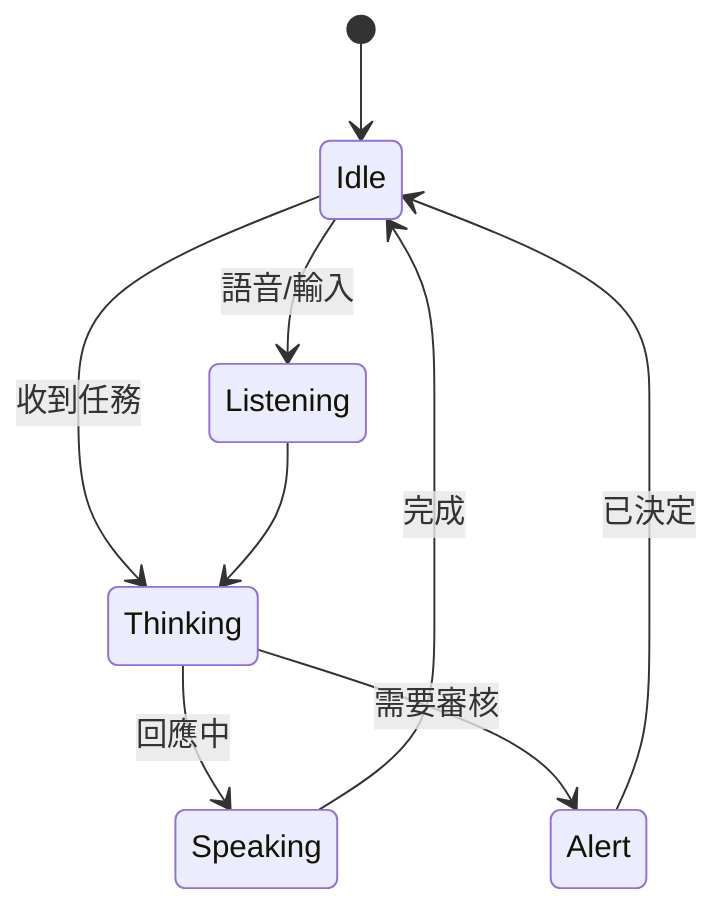
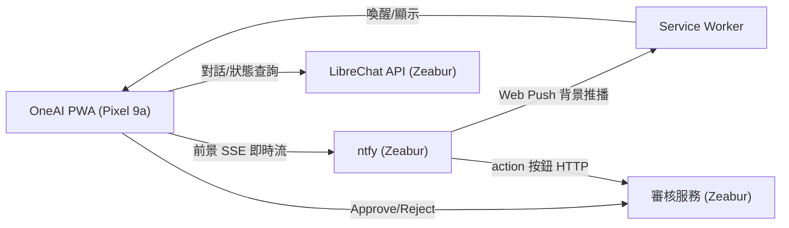

# 11 - OneAI 手機介面（會呼吸的 PWA）

## 11.1 目標與定位

- **手機（Pixel 9a）**：自製「OneAI」PWA，是你的隨身主控台 —— 有活著、會呼吸的視覺核心，整合通知、審核、即時狀態與輕量對話。
- **電腦**：用 LibreChat 內建 Web UI；桌面版 OneAI 之後再評估。
- PWA 以「加到主畫面」方式安裝進 Pixel 9a，享 OS 級 Web Push、全螢幕、離線殼。

## 11.2 為何用 PWA（而非原生 App）

- 一套程式碼，Pixel 9a 用 Chrome 即可安裝，免上架。
- 支援 Android 原生 **Web Push API**（VAPID + Service Worker），App 關閉也能收推播。
- 與雲端（LibreChat / ntfy / 審核服務）皆走 HTTPS，部署簡單。

## 11.3 技術棧（已選定）

| 層 | 選用 | 理由 |
|---|---|---|
| 建置 | Vite + React + TypeScript | 輕、快、生態成熟 |
| PWA | `vite-plugin-pwa`（Workbox）| service worker / manifest / 離線殼 |
| 會呼吸核心 | `react-three-fiber`（Three.js）+ 自訂 shader | WebGL orb 才有真正「活著」的呼吸/流動感 |
| UI 動態 | `framer-motion` | 卡片滑入、狀態轉場、attention 脈動 |
| 即時串流 | ntfy SSE / WebSocket | 前景即時活動流 |
| 推播 | Web Push API + 自架 ntfy（VAPID）| OS 級背景通知（見 [07](07-guardrail-ntfy-approval.md)）|
| 狀態 | Zustand（輕量）| 全域狀態（連線/任務/審核佇列）|

> 若日後要更輕，orb 可退回 Canvas 2D 實作；但 r3f shader 的呼吸質感最佳。

## 11.4 「會呼吸」視覺規格

中央能量核心（orb），依系統狀態改變呼吸節奏與色彩：



| 狀態 | 呼吸節奏 | 色彩 | 動態 |
|---|---|---|---|
| Idle 待命 | 慢呼吸 ~5s 週期，scale 0.97–1.03 | 電光藍青 cyan | 緩慢輝光起伏 + 微粒子環繞 |
| Listening 聆聽 | 中速脈動 | 青→白 | 邊緣波紋隨輸入跳動 |
| Thinking 思考 | 快脈動 + 內部流動 | 藍紫漸層 | 粒子向核心聚攏、能量流動 |
| Speaking 回應 | 隨節奏律動 | 亮青 | 聲波環擴散 |
| Alert 待審核 | 強烈 attention 脈動 | 琥珀 / 紅 | 核心收緊 + 警示環 |
| Success 完成 | 一次綻放後回 Idle | 綠 | 綠光外擴 bloom |

設計語言：深色底（near-black）、glassmorphism 玻璃面板、霓虹輝光、低調環境粒子；呼吸用正弦函數驅動 `scale` 與 `emissiveIntensity`，避免機械感。

## 11.5 畫面結構

```
┌─────────────────────────────┐
│  狀態列：連線 / 電量 / 時間      │   ← 頂部 glass bar
│                             │
│         ◯ 呼吸核心 orb       │   ← 中央 WebGL，狀態驅動
│      (狀態環 + 粒子場)        │
│                             │
│  ▸ 即時活動流（ntfy SSE）     │   ← 中段卡片串流
│                             │
│  ⚠ 審核卡片（滑入）           │   ← Approve / Reject 大按鈕
│                             │
│  [ 對話輸入 ____________ 🎤 ] │   ← 底部輸入 + 語音
└─────────────────────────────┘
```

## 11.6 與後端串接



- **背景**：Service Worker 透過 Web Push 收 ntfy 推播 → 顯示系統通知（含 Approve/Reject）。
- **前景**：App 開啟時連 ntfy SSE，活動流即時餵入呼吸核心狀態。
- **審核**：PWA 內或通知按鈕皆可回呼審核服務。
- **對話 / 狀態**：呼叫 LibreChat API（經 HTTPS）。

## 11.7 安裝到 Pixel 9a

1. PWA 部署於 Zeabur（靜態 + service worker，HTTPS）。
2. Pixel 9a 用 Chrome 開網址 → 選單「加到主畫面 / 安裝應用程式」。
3. 首次開啟請求通知權限 → `PushManager.subscribe`（VAPID 公鑰）→ 訂閱存到後端。
4. 確認鎖屏 / App 關閉時仍收到 Web Push。

## 11.8 安全

- VAPID 公鑰可內嵌前端；**私鑰僅後端**（ntfy / 審核服務 env）。
- 所有 API 走 HTTPS；ntfy 審核 topic 加 token。
- PWA 與後端以 token / session 認證，避免他人冒用。

## 11.9 開發里程碑（PWA 子階段）

- M1 殼：Vite+React+PWA 可安裝，manifest / service worker 就緒。
- M2 呼吸核心：r3f orb + 狀態機（Idle/Thinking/Alert…）。
- M3 推播：Web Push 訂閱 + 收 ntfy 背景通知。
- M4 審核：審核卡片 + Approve/Reject 回呼。
- M5 即時流 + 對話：ntfy SSE + LibreChat API 串接。

## 11.10 驗收清單

- [ ] PWA 可安裝進 Pixel 9a 主畫面、全螢幕。
- [ ] 呼吸核心會依狀態改變節奏與色彩（活著的感覺）。
- [ ] App 關閉仍收 Web Push（含審核按鈕）。
- [ ] Approve / Reject 可結案。
- [ ] 前景活動流即時更新；可發起輕量對話。
