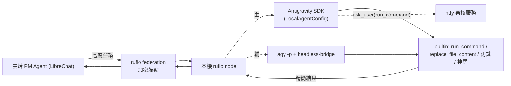
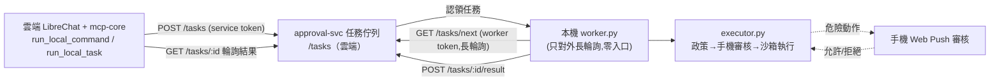

# 12 - The Hands：Antigravity 本機編碼/測試執行 agent

## 12.1 定位

Antigravity CLI（`agy`，Google Antigravity 2.0 harness）擔任**主要本機重度編碼與測試執行 agent**（支柱 2 The Hands）。OpenOneAI 降為選配補強。Antigravity 坐在**本機 ruflo federation node 後面**，不直接對雲端曝露原始 shell。

## 12.2 重要事實（已查證，避免誤用）

- `agy` 是 **MCP client**（讀 `~/.gemini/antigravity-cli/mcp_config.json` 或專案 `.agents/mcp_config.json` 去呼叫外部 MCP），**不是 MCP server**。
- `run_command` / `replace_file_content` 是 Antigravity 的**內部 builtin tools**（由它自己的 agent 驅動），**非對外可遠端呼叫的 MCP 端點**。
- 非互動：`agy -p "prompt"`；有 `--sandbox`（隔離容器執行）、`--model`、`--dangerously-skip-permissions`、`--add-dir`、`--continue`。
- headless 雷：`agy -p` 在非 TTY 會靜默無輸出（upstream bug #76），需 `agy-headless-bridge`（pty 包裝）才能從 subprocess/MCP/CI 取得輸出（提供 `agy_ask` / `agy_research`）。
- 官方 **Antigravity Python SDK**：`LocalAgentConfig` 內建 file I/O、code edit、shell（run_command）、search、sub-agent；具**宣告式 policy 引擎**（`deny` / `allow` / `ask_user(tool, handler)`）與 lifecycle hooks；shell 預設拒絕，需 `allow_all()` 或逐項 allow。

## 12.3 正確整合架構

雲端不直接驅動本機 shell；一律經本機 ruflo node 轉呼 Antigravity。



## 12.4 雙整合：SDK 為主、CLI 為輔

### 12.4.1 SDK（主）

用 `LocalAgentConfig` 在本機 ruflo node 內以 Python 呼叫，控制最細：

```python
from google.antigravity import Agent, LocalAgentConfig
from google.antigravity import policy  # deny/allow/ask_user

config = LocalAgentConfig(
    # 敏感工具走我們的審核 handler（轉 ntfy）
    policies=[
        policy.allow("view_file"),
        policy.allow("replace_file_content"),
        policy.ask_user("run_command", handler=ntfy_approval_handler),
    ],
)
async with Agent(config) as agent:
    resp = await agent.chat("修復 issue #123，跑測試，回傳精簡結果")
```

- `ask_user("run_command", handler=...)` 接到我們的 ntfy 審核（見 [07](07-guardrail-ntfy-approval.md)）→ **雙層護欄**。
- lifecycle hooks 可記錄每個 tool call（觀測/稽核）。

### 12.4.2 CLI bridge（輔）

簡單 prompt 層呼叫，或當 SDK 不便時備援：

```bash
# 透過 pty 橋接才有輸出
AGY_BRIDGE_TIMEOUT=600 agy-bridge "跑 Playwright suite X，回傳失敗摘要"
# 或隔離執行
agy -p "..." --sandbox
```

## 12.5 安全與護欄（多層）

1. **信任邊界**：雲端只送高層任務；raw shell 永遠在本機，經 ruflo node。
2. **Antigravity policy 引擎**：`run_command` 預設 `ask_user` → 轉 ntfy 審核。
3. **--sandbox**：高風險指令在隔離容器跑。
4. **回傳精簡**：只回摘要 + 關鍵 log，不灌爆雲端。
5. **審核節點**：仍遵守全域規則（寄信/花錢/發布/刪除需審核；部署免審）。

## 12.6 與其他元件關係

- **ruflo（Manager）**：調度者；把編碼/測試任務派給 Antigravity（Hands）。
- **ruflo-browser / Playwright**：瀏覽器測試；可由 Antigravity 的 run_command 觸發，或獨立。
- **OpenOneAI（選配）**：本機排程/語音 digest 補強，非主編碼手。
- **設定隔離**：Antigravity 用 `~/.gemini/`，與 ruflo 的 `.claude/` 平行，衝突低；skills 各自管理。

## 12.7 任務型別對應（雲↔本機契約）

沿用 [05](05-bridge-mcp-federation.md) 的任務契約，`type` 新增由 Antigravity 處理者：

| type | 由誰執行 | 說明 |
|---|---|---|
| `code_task` | Antigravity | 修 bug / 重構 / 實作（含 run_command + edit）|
| `run_tests` | Antigravity / Playwright | 跑測試回傳精簡 log |
| `code_review` | 雲端 Code Review Agent | 判讀結果 |
| `shell` | Antigravity（policy 管制）| 一般指令 |

## 12.8 驗收清單

- [ ] 本機 ruflo node 可經 SDK 呼叫 Antigravity 完成一個 `code_task`。
- [ ] `agy-bridge` CLI 備援可取得輸出（非 TTY 不靜默）。
- [ ] `run_command` 觸發 ntfy 審核（雙層護欄）生效。
- [ ] `--sandbox` 隔離執行可用。
- [ ] 結果以精簡摘要回傳雲端。
- [ ] 與 ruflo `.claude/` 設定不衝突。

## 12.9 實作:反向輪詢 worker（as-built,取代 federation 作為雲↔本機連線）

考量你的電腦在家用網路（NAT/防火牆後),為避免對外暴露入口,雲↔本機連線**改用「反向輪詢」**,不採 ruflo federation 的入站連線。連線模型最終定案如下:



### 元件與檔案

| 角色 | 檔案 / 端點 | 鑑權 |
|---|---|---|
| 雲端入列/取結果 | mcp-core `dispatchLocalTask` → `POST /tasks`、`GET /tasks/:id` | `APPROVAL_TOKEN`（service) |
| 佇列服務 | `services/approval/src/server.js`（`/tasks*`）+ `store.js`（持久化、重啟退回 queued） | — |
| 本機認領/回報 | **`hands/antigravity/worker.py`** → `GET /tasks/next`、`POST /tasks/:id/result` | `ONEAI_WORKER_TOKEN`（worker,最小權限) |
| 實際執行 + 審核 | `worker.py` 呼叫 `executor.py`（`run_command`/`run_task`)→ 政策→`approval_client` 送手機→沙箱 | `APPROVAL_TOKEN` |

> **審核護欄不在佇列做**:佇列僅傳輸。審核由本機 `executor.py` 在執行當下觸發（送手機),維持「危險動作必經手機」且參數雜湊防 TOCTOU。worker 離線時任務留在佇列,雲端輪詢逾時回提示。

### 在你電腦上啟動 worker

```bash
# 1) 一次性:於 .env 填入(三者與雲端 approval-svc 服務變數同值):
#    APPROVAL_BASE_URL=https://oneai-approval.zeabur.app
#    APPROVAL_TOKEN=<與 approval-svc 同值>
#    ONEAI_WORKER_TOKEN=<與 approval-svc 同值>
# 2) 啟動 worker(常駐;純 stdlib 免裝相依;只對外連線,Ctrl+C 停止)
#    PowerShell 可先載入 .env,或直接設環境變數後執行:
python hands/antigravity/worker.py
```

啟動後,於雲端對話呼叫 `run_local_command` / `run_local_task` 即會派到此 worker,危險動作會推播到手機等你授權。

### 安全要點

- worker **只對外長輪詢**,本機不開任何 port,NAT/防火牆友善。
- `ONEAI_WORKER_TOKEN` 為**最小權限**:只能拉任務 / 回報結果,不能建立審核。
- 執行仍走 `cli_bridge` 的沙箱(環境變數洗白 + 工作目錄牢籠 + `shell=False` + timeout)。
- 路由順序注意:`/tasks/next` 必須定義在 `/tasks/:id` 之前(否則 `:id` 會吃掉 `next` 走錯鑑權)。
