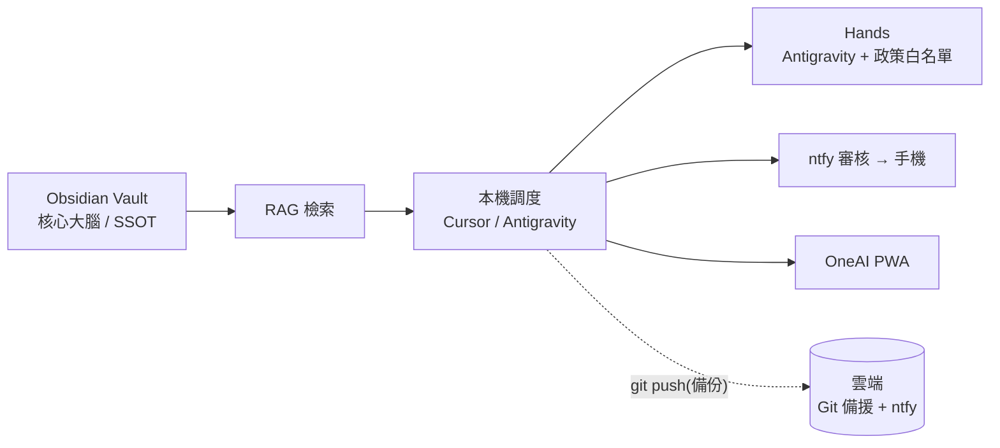

# 13 - 設計決策紀錄:過度設計體檢與簡化方向 (ADR)

> 狀態:**部分待拍板**。本文是藍圖的單一依據。與舊文件衝突時,以本文為準。
> 北極星:孟一的「心靈平靜、討厭繁瑣、KISS/YAGNI」。

## 核心原則(已定)

**Obsidian vault = 唯一核心大腦 (single source of truth)。** 系統一切知識/語氣對齊都回到這裡;其餘元件都是它的周邊。已寫入 `brain/vault/AGENTS.md`。

## 過度設計判決

| 元件 | 判決 | 處置 |
|---|---|---|
| Obsidian vault + RAG | ✅ 核心 | 保留 |
| OneAI PWA(會呼吸) | ✅ 明確需求 | 保留 |
| ntfy 審核 → 手機 | ✅ 護欄必要 | 保留(瘦身) |
| hands/antigravity + 政策白名單 | ✅ RCE 防線 | 保留 |
| Odysseus 雲端大腦(Zeabur 多容器) | 🔴 過度設計 + 授權/安全風險 | **待拍板**:建議**改用 LibreChat(MIT)**,理由見 [docs/14](14-stack-licensing-research.md) |
| ruflo federation + mTLS | 🔴 過度設計 | **待拍板**:建議廢除;遠端需求改 Tailscale |
| ruflo 98-agent swarm | 🟠 過度 | 建議精簡為少數角色(PM/寫手/coder/審查) |
| 雙推播(ntfy + 自建 VAPID) | 🟠 冗餘 | 建議只留 ntfy(可逆,待指示) |
| Skill 疊疊樂(SP/karpathy/grill/caveman/ruflo) | 🟠 冗餘 | 核心留 AGENTS.md + caveman,其餘選配 |
| ChromaDB | 🟡 可再簡 | 現用內嵌(OK);庫小可改長上下文注入 |
| OpenOneAI | 🔴 砍 | 與 Antigravity 重複,移出範圍 |

## 建議的簡化目標架構(本機優先)

一句話:**本機優先、Obsidian 當腦、雲端只當備胎。** 砍掉 Odysseus + mTLS + 98 agents + OpenOneAI + 雙推播,複雜度約砍半,維運趨近於零。

## 網路層決策

廢手刻 mTLS。若需要從外面連回家用 **Tailscale / WireGuard mesh**:自動託管加密 + NAT 穿透,零憑證運維(可逆,Type-2)。若全本機則連這層都不需要。

## 待拍板(單向門,需孟一明確同意才執行)

1. 雲端大腦:**Odysseus → LibreChat(MIT)**?(研究結論見 [docs/14](14-stack-licensing-research.md);Odysseus 授權混亂 + vibecoded 安全債,不宜當客戶地基)
2. 是否廢除 ruflo federation/mTLS,遠端改 Tailscale/Headscale(BSD-3)?

> 授權北極星(複製給客戶):自寫程式採 MIT;第三方優先 MIT/Apache/BSD,避免 AGPL 與專有品牌條款。清單見 [`/LICENSES.md`](../LICENSES.md)。

## 可逆小決策(說一聲即做)

- 拿掉雙推播冗餘(只留 ntfy)。
- 分級授權(低風險先斬後奏 + 事後通知)。註:政策層 `policy.py` 已對安全/部署自動放行,屬已做一半。
- 文件移除 OpenOneAI、Skill 瘦身、bridge 改名 `mcp-core`。

## 為何不在「跳過提問」時就動手砍

砍雲端大腦是不可逆且違背原始指示的動作。決策副手的職責是**擋下不可逆誤殺**,而非順從。故保留現狀,等孟一一句話。
