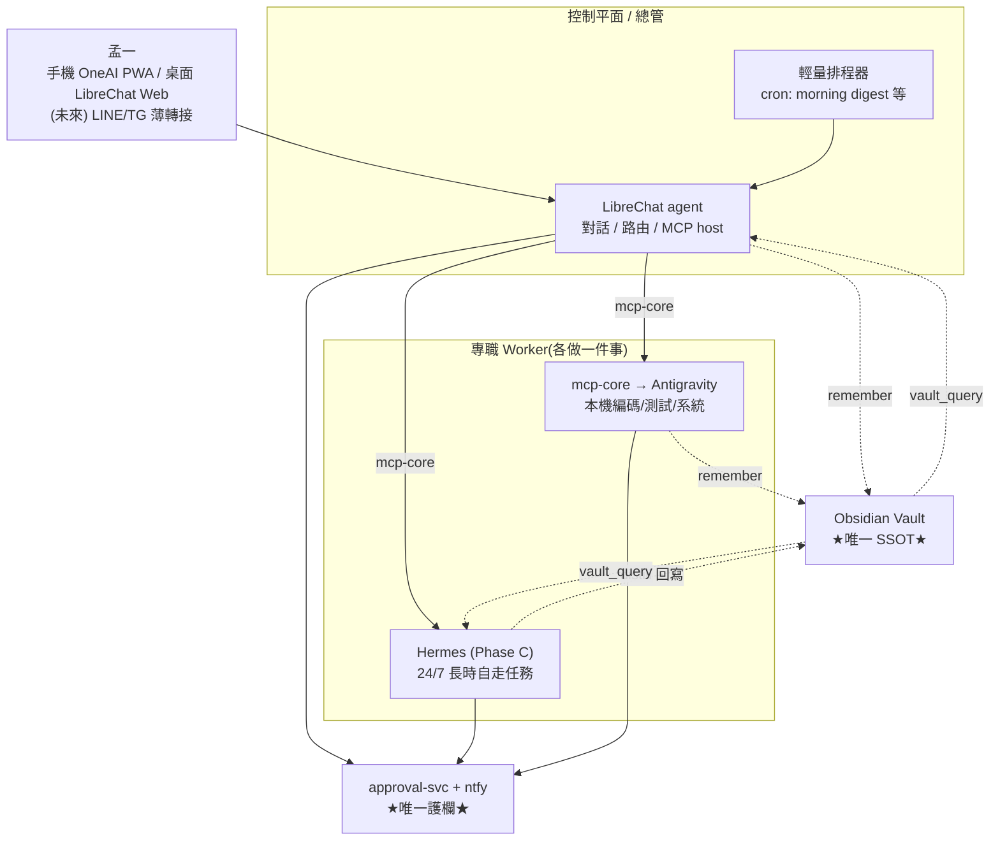

# 15 - 多 Agent 管理與編排（The Manager）

> 狀態：架構已定。與舊文件衝突時，本文與 [docs/13](13-design-review-simplification.md)、[docs/14](14-stack-licensing-research.md) 同為單一依據。
> 北極星：最強的系統 = **角色最清楚 + 攻擊面最小**，不是元件最多。KISS / YAGNI / DRY / 安全優先 / 永不遺忘。
> **2026-06-20 決策**：總管不採用 OpenClaw（安全債，見 15.9）；改以「LibreChat agent + 輕量排程器」為控制平面，全通道入口延後、需要時走薄轉接。

## 15.1 問題：四個控制平面 + 四套記憶

桌上會「當大腦／當總控」的東西曾有四個：LibreChat、OpenClaw、Hermes、ruflo；各自又有獨立記憶（LibreChat 記憶 / OpenClaw sessions / Hermes memory / Obsidian SSOT）。全部硬接 = 控制平面互打 + 記憶四散，違背「永不遺忘／單一大腦」，且製造維運債與攻擊面。

**解法：收斂成單一控制平面（LibreChat agent）+ 單一 SSOT + 單一護欄；worker 角色單一。**

## 15.2 元件查證與角色定位

| 專案 | 本質 | 授權 | 角色定位 | 採用 |
|---|---|---|---|---|
| LibreChat | 多供應商對話 + Agents/MCP/RAG/多用戶 | MIT | **控制平面 / 推理 / 路由 + 桌面工作台** | ✅ |
| Hermes Agent (`NousResearch/hermes-agent`) | 24/7 自走、持久記憶 + 閉環學習（自動寫 skill） | MIT | **長時自走 worker**（Phase C） | ✅（worker） |
| Antigravity | 本機編碼/測試/系統操作 | 專有(個人用) | **本機手 worker**（客戶版換 Aider） | ✅（個人） |
| OpenClaw (`openclaw/openclaw`) | 全通道 Gateway（20+ 管道、語音、Canvas、cron、routing） | MIT | 原擬「全通道總管」 | ❌ **棄用（安全，見 15.9）** |

> 關鍵釐清：Hermes 官方明言「是 agent，不是建 agent 的框架」「是單一 agent，不是多 agent 編排器」→ **它是 worker，不是 manager**。

## 15.3 拓樸（單一控制平面 + 清楚分工 + 單一大腦）

> 未來若要從 LINE/Telegram 指揮:寫一支 **薄通道轉接(stateless webhook,~100 行)**,把訊息轉給 LibreChat/`mcp-core` 即可,**不引入整套外部 Gateway**(見 15.8 Phase B)。

## 15.4 三條鐵律（讓系統不亂的根本）

1. **唯一大腦（SSOT）**：Obsidian vault 是唯一記憶真相。LibreChat/Hermes 各自記憶只是**短期快取**；定期 distill 回寫 vault（經 `remember`），vault 再經 `vault_query` 餵回所有 agent。→ 永不遺忘、不分裂。
2. **唯一護欄**：寄信/花錢/發布/刪除，無論哪個 agent 發起，一律走 `approval-svc + ntfy`（經 `mcp-core` 的 `request_approval`）。
3. **唯一控制平面**：路由/推理集中在 **LibreChat agent 層（+ 排程器）**，其餘皆 worker；通道一律是**薄、無狀態**的轉發層，只送訊息不做決策、不另存記憶。

## 15.5 整合契約：用 `mcp-core` 當共同接點

所有 worker 都經 MCP 統一掛 `bridge/mcp-core`，**不各自重造記憶與護欄**：

| 工具 | 用途 | 誰掛 |
|---|---|---|
| `vault_query` | 從 SSOT 取記憶（已限長防 OOM） | LibreChat / Hermes |
| `remember` | 把學到的偏好/SOP/反思 distill 回 vault | 全部 worker |
| `request_approval` | 關鍵動作送手機審核（非阻塞輪詢 + token） | 全部 worker |
| `run_local_command` / `run_local_task` | 本機手（僅本機 host，政策白名單） | LibreChat / Hermes |

> 這層 glue 是「我們的系統」之所以成立的關鍵：外部平台被收斂成「共用一個大腦、共用一個護欄」。

## 15.6 編排模式選型（依規模，勿過度設計）

- 1–3 角色（**我們現況**）：LibreChat agent 路由 + 循序呼叫 worker，已足夠。
- 3–5 角色：扁平 Supervisor（LibreChat agent 當 router）。
- 需要複雜分支/迴圈/**HITL 斷點**：再加 **LangGraph（MIT）** 當自建 supervisor，其 HITL 節點直接接我們已修好的 `approval-svc`；角色型快速原型可用 **CrewAI（MIT）**。

> 現在不要上 LangGraph/ruflo swarm（YAGNI）。LibreChat agents + `mcp-core` 已足夠。

## 15.7 待解風險

- **本機資源**：Hermes（Python 24/7）建議放便宜 VPS，避免與本機手搶資源。
- **記憶 distill 節奏**：建議事件觸發（任務完成）+ 每日彙整，回寫 vault。
- **Skills SSOT**：Hermes(agentskills.io) / 我們 AGENTS.md+caveman → 統一 skill 來源，避免分裂。
- **排程器選型**：morning digest 等用輕量 cron（Zeabur cron / OS 排程 / 小型 Node 服務擇一），呼叫 `mcp-core` 或 LibreChat API；YAGNI，先最小。

## 15.8 分階段落地（不要一次全上）

- **Phase A（現況）**：LibreChat + `mcp-core`（vault/記憶/審核/本機手）。✅ 多數已建。
- **Phase B（缺口觸發）**：真的需要 LINE/Telegram 才做——寫**薄通道轉接**(無狀態 webhook)轉給 LibreChat/`mcp-core`,先接 1 個管道。**不引入 OpenClaw**。
- **Phase C**：導入 **Hermes** 當 24/7 worker（放 VPS），掛 `mcp-core`，設定 distill 回寫 vault。
- **Phase D（選配）**：若需複雜編排/評估回測，再加 **LangGraph** supervisor + agent 評估層。

## 15.9 決策紀錄（ADR）：總管為何不採用 OpenClaw

**情境**：OpenClaw（MIT、34 萬星）定位確實是「全通道 Gateway / 控制平面」，最初擬作總管。

**否決理由（第一性原理 + 安全優先 + DRY）**：

1. **嚴重安全債,且爛在要對外曝露的 Gateway 層**：
   - CVE-2026-32922(CVSS **9.9**):token rotation 權限提升 → `operator.admin` → 全節點 RCE。
   - CVE-2026-43585(9.2):金鑰輪替後舊 bearer token 仍有效。
   - CVE-2026-25253(8.8):一鍵 RCE,**13.5 萬台無認證實例曝露公網**。
   - CVE-2026-25157:Gateway 指令注入。
   - arXiv《OpenClaw 安全漏洞系統性分類》初次審計 **512 漏洞(8 critical)**;ClawHub 技能市集 **26% 有漏洞**(供應鏈投毒)；明文存憑證；改名三次(Clawdbot→Moltbot→OpenClaw)。
   - 風險型態與已棄用的 Odysseus 同源(爆紅 vibecoded + 控制平面安全債)。
2. **架構重複(DRY)**:OpenClaw 內含 Agent Runtime / 記憶 / 本機執行 / 護欄,與我們既有的 LibreChat / Obsidian(SSOT) / mcp-core+Antigravity / approval-svc **大量重疊**,且其記憶與權限層會**搶走我們「唯一 SSOT / 唯一護欄」的定位**。
3. **唯一真正補的缺口只有「全通道入口」**——為這一塊揹整套高風險閘道,不符 KISS/YAGNI。

**決議**:總管改用「LibreChat agent + 輕量排程器」;全通道延後,需要時以薄轉接補單一管道。若未來客戶情境強烈需要多通道且接受維運負擔,再回頭評估 OpenClaw 薄閘道用法(pin 最新修補版、綁 127.0.0.1、置於 Tailscale/反代鑑權後、禁用 ClawHub 技能、關閉其本機執行改打我們的 mcp-core)。

**影響**:LICENSES.md 將 OpenClaw 改列「評估後棄用(安全)」;plan 的 phaseB-openclaw 改為「薄通道轉接(延後)」。
